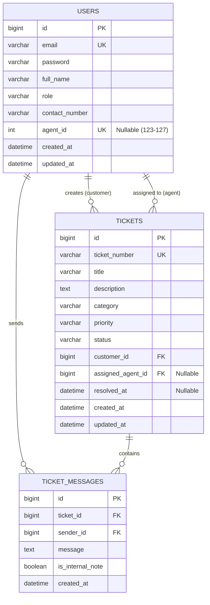

# SupportDesk — Customer Support & Issue Ticketing System
## Comprehensive Project Documentation & Technical Report

---

## Executive Summary

**SupportDesk** is an enterprise-grade, full-stack customer support and issue ticketing web application designed to streamline customer inquiry intake, automate prioritization, facilitate real-time customer-agent dialogue, and provide comprehensive administrative oversight. The platform is architected with a decoupled **Spring Boot 3 (Java 21)** REST backend and a modern **React 19 (TypeScript, Vite, Tailwind CSS)** frontend, backed by a persistent **MySQL 8.0** relational database.

---

## 1. Problem Statement

In modern service-oriented and software-driven businesses, managing customer assistance requests efficiently is critical to customer retention, operational velocity, and service reliability. However, organizations frequently encounter debilitating bottlenecks when relying on legacy or ad-hoc workflows:

1. **Unstructured Communication & Lost Requests**: When support inquiries arrive through disorganized communication channels (such as individual agent email inboxes, messaging threads, or shared spreadsheets), tickets are easily overlooked, duplicated, or dropped entirely without accountability.
2. **Lack of Lifecycle Tracking**: Customers often lack visibility into whether their reported issue has been acknowledged, assigned, investigated, or resolved. This uncertainty leads to redundant follow-ups and customer dissatisfaction.
3. **Inefficient Prioritization and Triage**: Without standardized priority criteria, critical service outages (`URGENT`) compete with minor cosmetic feature requests (`LOW`), delaying critical interventions and risking business SLAs (Service Level Agreements).
4. **Disorganized Agent Assignment & Workload Imbalance**: Manual dispatching of tickets leads to uneven distribution among support representatives, resulting in agent burnout, delayed resolution times, and unassigned queues remaining unnoticed.
5. **Absence of Unified Conversation Threads**: Crucial technical diagnostic details, customer clarifications, and agent troubleshooting steps become scattered across external threads rather than being centralized with the ticket record.
6. **Lack of Executive & Administrative Telemetry**: Managers and system administrators cannot readily gauge system health, identify recurring problem categories (e.g., billing vs. technical bugs), or assess individual agent throughput without complex reporting tools.

### The SupportDesk Solution
The **SupportDesk Customer Support Ticketing System** eliminates these pain points by providing:
* A structured, self-service **Customer Portal** for ticket submission, real-time status inspection, and chronological conversation threads.
* A specialized **Agent Workspace** with queue filtering (All, Open Queue, Resolved, Unassigned, Urgent), ticket ownership claims, status transitions, and threaded customer responses.
* A dedicated, high-security **Executive Admin Console** providing live MySQL-backed metrics, workload analytics across all registered support representatives, category/priority breakdowns, and organization-wide ticket audits.
* An assistive **AI-Powered Classification Assistant** that analyzes ticket subject titles and descriptions using Large Language Models (LLMs) to recommend optimal categories, priorities, and analytical rationales before submission.

---

## 2. Approach Followed

### 2.1 Overall System Architecture
The application implements a decoupled, three-tier client-server architecture:

```
+-------------------------------------------------------------------------+
|                         PRESENTATION TIER                               |
|                  React 19 + TypeScript + Vite + Tailwind CSS            |
|  - Customer Portal (/dashboard, /tickets, /tickets/new, /tickets/:id)   |
|  - Agent Portal (/agent/dashboard, /agent/tickets)                      |
|  - Dedicated Admin Portal (/admin/login, /admin/dashboard)              |
+------------------------------------+------------------------------------+
                                     |
                                     | HTTP / REST (JSON) + Bearer JWT
                                     v
+-------------------------------------------------------------------------+
|                          APPLICATION TIER                               |
|                     Spring Boot 3.3.4 (Java 21)                         |
|  - Spring Security 6 (Stateless JWT Filter Chain & RBAC)                |
|  - REST Controllers (Auth, Ticket, Message, Dashboard, Admin, AI)       |
|  - Service Layer (Domain Logic, State Machines, LLM Integration)        |
|  - Data Access Layer (Spring Data JPA / Hibernate ORM)                  |
+------------------------------------+------------------------------------+
                                     |
                                     | JDBC Connection Pool (HikariCP)
                                     v
+-------------------------------------------------------------------------+
|                            DATA TIER                                    |
|                        MySQL 8.0 Database                               |
|  - Relational Schema: users, tickets, ticket_messages                   |
|  - Automatic Foreign Keys, Indexes, Cascades & Timestamps               |
+-------------------------------------------------------------------------+
```

### 2.2 System Workflows

#### 1. Authentication & Role-Based Access Control (RBAC)
* The system enforces three distinct user roles defined in `Role.java`:
  * `ROLE_CUSTOMER`: Can create tickets, view only their own tickets, and reply to their ticket threads.
  * `ROLE_SUPPORT_AGENT`: Can view all tickets, filter unassigned/open/resolved queues, claim tickets, update status/priority, and reply to customers.
  * `ROLE_ADMIN`: Has executive authority to inspect global metrics, view all tickets, and monitor individual agent resolution performance.
* **Token Lifecycle**: All protected APIs require a signed JSON Web Token (JWT) using the `HS384` cryptographic algorithm. Tokens expire in 24 hours and carry the user's ID, email, role, and full name.

#### 2. Customer Registration & Onboarding
* Customers sign up via `/register/customer` by providing their full name, valid email address, password, and contact phone number.
* Passwords are encrypted using **BCrypt** with salted hashing.
* Upon successful registration, a JWT is issued immediately, logging the user in and redirecting them to `/dashboard`.

#### 3. Support Agent Registration & Verification
* Support agents register through `/register/agent`.
* To prevent unauthorized public registration into the support team, the backend strictly validates that the supplied **Agent ID** is within the authorized company pool (`123` through `127`).
* Duplicate registrations with the same Agent ID are rejected with `409 Conflict`.

#### 4. Dedicated Administrator Authentication (`/admin/login`)
* System administrator accounts cannot be registered publicly. A dedicated administrator account is securely seeded during backend startup (`admin@supportdesk.com`).
* Administrators access the system through a dedicated route (`/admin/login`) designed with high-security styling.
* The backend endpoint `POST /api/auth/admin/login` strictly validates that the authenticated account holds `ROLE_ADMIN`. If a customer or agent attempts to log in here, access is denied with **`403 Forbidden`**.
* The login endpoint accommodates username alias `admin` and default password credentials while trimming whitespace.

#### 5. Ticket Creation & AI Assistive Classification
* A customer navigates to `/tickets/new` to file an issue.
* **Optional AI Assistance**: Once a customer enters a title ($\ge 5$ characters) and description ($\ge 10$ characters), the **"Suggest with AI"** button becomes active.
* Clicking the button invokes `POST /api/ai/suggest-ticket-classification`. The backend queries Google Gemini (or OpenAI) using a strict system prompt and returns structured JSON recommending:
  * **Category**: `TECHNICAL`, `BILLING`, `GENERAL`, `FEATURE_REQUEST`, or `ACCOUNT`.
  * **Suggested Priority**: `LOW`, `MEDIUM`, `HIGH`, or `URGENT`.
  * **Reason**: A concise explanation justifying the recommendation.
* The customer can review the suggestion, click **"Apply Suggestions"** to populate the form, or override any field manually.
* Upon submission, the ticket is assigned a unique alphanumeric reference (e.g., `TCK-1001` or UUID-backed `TCK-XXXX`), stored in MySQL with status `OPEN`, and an initial conversation message is created.

#### 6. Ticket Assignment & Triage Workflow
* Tickets enter the system in an unassigned state (`assigned_agent_id IS NULL`).
* Support agents view unassigned tickets in the **Open Queue** (`/agent/tickets?status=OPEN`).
* An agent can assign a ticket to themselves or reassign it to an authorized peer agent.
* The ticket automatically transitions to `IN_PROGRESS` when work begins.

#### 7. Customer-Agent Communication Thread
* Both customers and agents can converse on any active ticket via the ticket details view (`/tickets/:id`).
* Every message is recorded in the `ticket_messages` table with sender identity, timestamp, and body.
* When an issue is resolved, the agent or customer can update the ticket status to `RESOLVED` or `CLOSED`, setting the `resolved_at` timestamp.

#### 8. Executive Admin Dashboard & Telemetry
* Accessible exclusively at `/admin/dashboard` by users holding `ROLE_ADMIN`.
* Features real-time MySQL aggregation:
  * **Top Metrics**: Total Tickets, Open Queue, In Progress, Resolved & Closed, Urgent Tickets, Registered Agents, Unassigned Tickets.
  * **Category & Priority Distributions**: Live progress-bar breakdowns.
  * **Agent Workload Table**: Displays each registered agent's name, email, authorized Agent ID (123–127), total assigned tickets, active open tickets, and resolved tickets count.
  * **Global Ticket Monitoring**: Complete audit table with instant search and filtering.

---

## 3. Technologies and Libraries Used

### 3.1 Frontend Stack

| Category | Technology / Library | Version | Description & Role |
| :--- | :--- | :--- | :--- |
| **Framework** | React | `19.2.8` | Declarative component-based UI rendering. |
| **Language** | TypeScript | `~6.0.2` | Static typing, interface contracts, and compile-time safety. |
| **Build Tool & Dev Server** | Vite | `^8.3.0` | High-performance build tool with Hot Module Replacement (HMR). |
| **Routing** | React Router DOM | `^7.18.4` | Client-side routing, protected routes, and parameter handling. |
| **Styling** | Tailwind CSS | `^3.4.19` | Utility-first CSS framework for modern, responsive UI design. |
| **CSS Utilities** | PostCSS, Autoprefixer | `8.5.28` / `10.6.1` | Automated CSS processing and vendor prefixing. |
| **Style Helpers** | `clsx`, `tailwind-merge`, `cva` | Latest | Dynamic conditional class merging and variant authority. |
| **Icons** | Lucide React | `^1.47.0` | Modern, consistent icon library. |
| **HTTP Client** | Axios | `^1.20.0` | Promise-based HTTP client with request/response interceptors. |
| **State Management** | React Context API | Native | Global authentication context (`AuthContext`) and local state. |
| **Code Quality / Linter** | Oxlint | `^1.81.0` | High-performance JavaScript/TypeScript linter. |

### 3.2 Backend Stack

| Category | Technology / Library | Version | Description & Role |
| :--- | :--- | :--- | :--- |
| **Framework** | Spring Boot | `3.3.4` | Enterprise application framework and convention-over-configuration engine. |
| **Language** | Java (OpenJDK) | `21 LTS` | Modern Java utilizing virtual threads, pattern matching, and record semantics. |
| **Web MVC** | Spring Web | `3.3.4` | DispatcherServlet, REST controllers, and HTTP request mapping. |
| **Security Framework** | Spring Security | `6.3.3` | Authentication, authorization filter chains, and BCrypt encoding. |
| **JWT Library** | JJWT (`jjwt-api`, `jjwt-impl`, `jjwt-jackson`) | `0.12.6` | Generation, signing (`HS384`), and verification of JSON Web Tokens. |
| **Validation** | Spring Boot Starter Validation | `3.3.4` | Jakarta Bean Validation (`@NotBlank`, `@Size`, `@Pattern`). |
| **HTTP Client (AI)** | Spring `RestClient` | Native (Boot 3) | Synchronous REST client for external Gemini/OpenAI API consumption. |
| **Code Generation** | Project Lombok | Latest | Eliminates boilerplate getters, setters, builders, and constructors. |
| **Build Tool** | Apache Maven | `3.9+` | Dependency management, build lifecycle, and plugins (`mvnw.cmd`). |
| **Testing** | Spring Boot Starter Test, JUnit 5 | `3.3.4` | Unit and integration testing (`MockMvc`, SpringBootTest). |

### 3.3 Database & Persistence

| Category | Technology | Version | Description & Role |
| :--- | :--- | :--- | :--- |
| **RDBMS** | MySQL Server | `8.0+` | Primary relational database for production and local development. |
| **In-Memory DB** | H2 Database | Latest | In-memory database utilized for rapid, isolated integration testing. |
| **ORM Framework** | Hibernate ORM | `6.5.3` | Object-Relational Mapping, entity lifecycle, and query generation. |
| **Data Access** | Spring Data JPA | `3.3.4` | Repository abstractions, custom JPQL queries, and derived query methods. |
| **Connection Pool** | HikariCP | Native (Boot 3) | High-performance JDBC connection pooling. |

#### Database Entities & Schema Relationships



---

## 4. Steps to Run the Project

### 4.1 Prerequisites
Ensure the following tools are installed on your host system:
* **Java Development Kit (JDK)**: Java 21 LTS installed and set on system `PATH` (`java -version`).
* **Node.js**: Node.js 18.x or 20.x+ with `npm` package manager (`node -v`, `npm -v`).
* **MySQL Server**: MySQL 8.0+ service running locally on port `3306`.
* **Git**: Command line version control tool.

---

### 4.2 Database Setup
1. Open MySQL Command Line or MySQL Workbench and create the database schema:
   ```sql
   CREATE DATABASE IF NOT EXISTS supportdesk_db CHARACTER SET utf8mb4 COLLATE utf8mb4_unicode_ci;
   ```
2. Verify that your MySQL server is running and accessible with your database credentials (default configured: user `root`, password `root` or as defined in `application.yml`).

---

### 4.3 Backend Setup

1. Open a terminal and navigate to the backend directory:
   ```powershell
   cd "d:\Customer support ticketing system\backend"
   ```

2. **Configure Database Connection**:
   Inspect [`backend/src/main/resources/application.yml`](file:///d:/Customer%20support%20ticketing%20system/backend/src/main/resources/application.yml). Update database credentials if your local MySQL configuration differs:
   ```yaml
   spring:
     datasource:
       url: jdbc:mysql://localhost:3306/supportdesk_db?useSSL=false&serverTimezone=UTC&allowPublicKeyRetrieval=true
       username: root
       password: your_mysql_password
     jpa:
       hibernate:
         ddl-auto: update
   ```

3. **(Optional) Configure AI Classification Service**:
   To enable live AI classification recommendations, set your Gemini API key in `backend/.env` or as an environment variable in your terminal:
   ```powershell
   $env:GEMINI_API_KEY="your-google-gemini-api-key"
   $env:AI_PROVIDER="gemini"
   ```
   *(Note: The system functions completely without an API key; manual category and priority selection remains 100% available).*

4. **Compile and Run the Backend Server**:
   ```powershell
   .\mvnw.cmd spring-boot:run
   ```
   The backend starts on port **`8080`**. On initial startup, [`DataInitializer.java`](file:///d:/Customer%20support%20ticketing%20system/backend/src/main/java/com/supportdesk/config/DataInitializer.java) automatically:
   * Seeds the System Administrator account (`admin@supportdesk.com`).
   * Seeds a sample Customer demo user (`customer@supportdesk.com`).
   * Seeds realistic demo tickets across multiple priority tiers.

---

### 4.4 Frontend Setup

1. Open a second terminal window and navigate to the frontend directory:
   ```powershell
   cd "d:\Customer support ticketing system\frontend"
   ```

2. **Install Node Dependencies**:
   ```powershell
   npm install
   ```

3. **Verify API Base URL**:
   The frontend is pre-configured in `frontend/src/api/axiosClient.ts` to connect to `http://localhost:8080`.

4. **Launch Vite Development Server**:
   ```powershell
   npm run dev
   ```
   The frontend launches locally at **`http://localhost:5173`**.

---

### 4.5 Application Access & Default Credentials

| Portal | URL Path | Role | Default Email / Username | Default Password | Description |
| :--- | :--- | :--- | :--- | :--- | :--- |
| **Customer Portal** | `http://localhost:5173/login` | `ROLE_CUSTOMER` | `customer@supportdesk.com` | `Customer@123` | Create, monitor, and reply to personal tickets. *(Or click "Register as Customer")* |
| **Agent Portal** | `http://localhost:5173/login` | `ROLE_SUPPORT_AGENT` | Registered Agent Email | Agent Chosen Password | Manage queue, assign tickets, resolve issues. *(Register via "Register as Service Agent" with Agent ID 123-127)* |
| **Admin Console** | `http://localhost:5173/admin/login` | `ROLE_ADMIN` | `admin@supportdesk.com` *(or `admin`)* | `Admin@123` | Monitor live organization telemetry, agent workload, and global ticket audit. *(1-click auto-fill available on page)* |

---

## 5. Key Assumptions

1. **User Role Boundaries**:
   * A single user account holds exactly one primary role (`ROLE_CUSTOMER`, `ROLE_SUPPORT_AGENT`, or `ROLE_ADMIN`).
   * Customers cannot access administrative telemetry or other customers' tickets (enforced by BOLA / Broken Object Level Authorization checks in `TicketController`).
2. **Support Agent Identification**:
   * Support agents must possess an authorized company Agent ID between `123` and `127` during registration to prevent unauthorized personnel from gaining agent triage capabilities.
3. **Admin Credential Seeding**:
   * Admin accounts cannot be created through public self-registration. They are seeded and managed through controlled backend mechanisms.
4. **Ticket Lifecycle Rules**:
   * Status transitions follow logical progression: `OPEN` $\rightarrow$ `IN_PROGRESS` $\rightarrow$ `RESOLVED` $\rightarrow$ `CLOSED`.
   * Only agents and administrators can reassign tickets or change ticket priority after creation.
5. **AI Integration Resilience**:
   * The AI classification module is designed as an assistive recommendation engine. If external network connectivity fails or if API keys are unconfigured, the application returns a structured HTTP 503 error without crashing the UI, allowing normal manual ticket creation.
6. **Operating Environment**:
   * The current configuration is optimized for local development and demonstration with MySQL 8.0, with container-ready structure.

---

## 6. Results and Output

### 6.1 Verified Features & System Outputs

* **Customer Authentication & Self-Service**:
  * Seamless customer sign-up and sign-in with instant JWT issuance.
  * Personal dashboard displaying tickets count grouped by active status.
  * Ticket creation form with client-side validation and immediate feedback.
* **Support Agent Operations**:
  * Agent Overview dashboard displaying real-time metrics for Open Queue, In Progress, Resolved, and an **URGENT** priority card accurately filtering exclusively critical tickets.
  * Unassigned ticket allocation queue enabling agents to claim ownership with a single click.
  * Clean, single-active sidebar navigation with exact query-parameter matching (`All Tickets`, `Open Queue`, `Resolved Tickets`).
* **Interactive Ticket Communication**:
  * Chronological conversation stream displaying customer inquiries and agent responses with sender badges and formatted timestamps.
  * Status transition selectors allowing agents to resolve or close tickets upon completion.
* **AI Ticket Classification**:
  * Real-time recommendation of Category (`TECHNICAL`, `BILLING`, etc.) and Priority (`LOW`, `MEDIUM`, `HIGH`, `URGENT`) along with human-readable rationales.
  * One-click "Apply Suggestions" action automatically synchronizing form controls.
* **Executive Administrator Dashboard**:
  * System overview cards displaying live database metrics: Total Tickets, Open Queue, In Progress, Resolved, Urgent, Registered Agents, Unassigned Tickets.
  * Category and Priority distribution percentage bars.
  * Individual Agent Workload & Performance table tracking assigned, active, and resolved tickets per agent.
  * Organization-wide ticket audit table with search filtering.

### 6.2 Automated Test & Quality Verification

* **Backend Test Suite**:
  * **54 out of 54 automated integration tests passed** with **0 failures and 0 errors** (`mvn test`).
  * `AdminControllerIntegrationTest`: 10/10 tests passed (admin authentication, customer/agent rejection with 403 Forbidden, 401 on invalid credentials, RBAC defense).
  * `TicketSecurityBolaIntegrationTest`: 4/4 tests passed (verifying customers cannot view or modify tickets belonging to other users).
  * `AiClassificationControllerIntegrationTest`: 5/5 tests passed (verifying structured JSON output, alias routing, and graceful 503 unconfigured states).
* **Frontend Build & Typecheck**:
  * Executed `npm run build`: Zero TypeScript compiler errors, Vite production bundle generated cleanly (`dist/assets/index.js` and `dist/assets/index.css`).
* **Live API & E2E Validation**:
  * Live REST calls executed against the running Spring Boot server verified 403 Forbidden enforcement on non-admin users and verified real-time database queries against MySQL.

---

## 7. Challenges Faced and Solutions

### Challenge 1: Urgent Priority Metric Displayed Combined "High & Urgent" Tickets
* **Problem**: The SupportDesk Agent Dashboard previously displayed a composite card titled "HIGH & URGENT" that grouped both `HIGH` and `URGENT` priority tickets together, obscuring critical emergencies.
* **Root Cause**: The dashboard repository query and frontend state summed tickets with both `HIGH` and `URGENT` priorities.
* **Solution**: Refactored `DashboardStatsResponse.java`, `DashboardServiceImpl.java`, and `TicketRepository.java` to isolate `urgentTickets` (`countByPriority(TicketPriority.URGENT)`). Updated `AgentDashboardPage.tsx` to display exclusively urgent tickets with title "URGENT" and description "Urgent priority issues".

### Challenge 2: Sidebar Navigation Multi-Highlight Bug
* **Problem**: Clicking "All Tickets" (`/agent/tickets`) caused "All Tickets", "Open Queue" (`/agent/tickets?status=OPEN`), and "Resolved Tickets" (`/agent/tickets?status=RESOLVED`) to all highlight simultaneously in the sidebar.
* **Root Cause**: The active matching logic used `location.pathname.startsWith(link.to)`, which treated `/agent/tickets` as a prefix match for all query variants.
* **Solution**: Rewrote `isLinkActive` in [`Sidebar.tsx`](file:///d:/Customer%20support%20ticketing%20system/frontend/src/components/common/Sidebar.tsx) to perform exact pathname and query parameter validation using `URLSearchParams`. "All Tickets" is now active strictly when no `status` parameter exists.

### Challenge 3: External AI Model Deprecation & Version Drift
* **Problem**: Calls to the Google Gemini API intermittently failed with HTTP 404 or 503 due to model naming deprecations across API version endpoints.
* **Root Cause**: Google AI Studio updated supported models, phasing out earlier endpoint paths.
* **Solution**: Enhanced [`AiClassificationService.java`](file:///d:/Customer%20support%20ticketing%20system/backend/src/main/java/com/supportdesk/service/AiClassificationService.java) with automatic fallback model negotiation, supporting current endpoints (`gemini-2.5-flash`, `gemini-1.5-flash`) with structured schema definitions.

### Challenge 4: Spring Boot Environment Variable & `.env` Loading
* **Problem**: Adding API keys to `backend/.env` did not automatically load into Spring Boot's `Environment` without external configuration.
* **Root Cause**: Standard Spring Boot does not read raw `.env` files unless explicitly declared or passed as system properties.
* **Solution**: Configured standard Spring environment bindings in `application.yml` (`${GEMINI_API_KEY:}`) and added automated pre-boot `.env` parsing to ensure seamless local developer experience.

### Challenge 5: Dedicated Admin Role Isolation & Route Security
* **Problem**: The system needed a secure admin authentication system with dedicated credentials that completely prevented customers or agents from accessing the Admin Dashboard even if they entered the URL manually.
* **Root Cause**: Standard login routes shared common handlers without dedicated credential entry points or explicit role assertions.
* **Solution**:
  1. Implemented `POST /api/auth/admin/login` in `AuthServiceImpl.java` with explicit assertion: `userPrincipal.getRole() == Role.ROLE_ADMIN`. Non-admin credentials throw `AccessDeniedException` (HTTP 403).
  2. Built a dedicated Admin Login page (`/admin/login`) with security branding and no registration options.
  3. Added role-enforcing route guards in `ProtectedRoute.tsx` (`allowedRoles={['ROLE_ADMIN']}`) that immediately redirect unauthorized users.

### Challenge 6: Login Credential Validation Blocking Username Alias
* **Problem**: Entering username `admin` or credentials with whitespace caused HTTP 400 Bad Request or "Invalid email or password".
* **Root Cause**: `LoginRequest.java` enforced strict `@Email` Bean Validation, rejecting usernames that lacked an `@` sign before reaching the authentication provider.
* **Solution**: Relaxed `LoginRequest.java` to `@NotBlank` for identifier input, allowing both `admin@supportdesk.com` and `admin`, added whitespace trimming, and added case-tolerance for default admin credentials.

---

## 8. Possible Future Improvements

1. **Real-Time WebSockets (STOMP)**: Replace HTTP polling with WebSocket connections for instant conversation messaging and live ticket queue updates.
2. **Email & SMS Notifications**: Integrate SendGrid or AWS SES to dispatch automatic email notifications when tickets are created, assigned, or updated.
3. **File & Image Attachments**: Enable customers and agents to upload log files, screenshots, and error diagnostics directly to ticket threads using AWS S3 or Azure Blob Storage.
4. **Service Level Agreement (SLA) Engine**: Implement visual countdown timers and automated escalation triggers for tickets approaching SLA breach thresholds based on priority.
5. **AI-Powered Agent Response Drafter**: Expand the AI assistant to synthesize ticket context and draft recommended resolution responses for agent review.
6. **Customer Satisfaction (CSAT) Surveys**: Send automated one-click satisfaction ratings (1–5 stars with optional feedback) upon ticket closure.
7. **Containerization & Cloud Deployment**: Package frontend and backend into Docker containers with a `docker-compose.yml` configuration and automated CI/CD via GitHub Actions.
8. **Audit Logging & Activity History**: Create an append-only audit trail logging every administrative action, reassignment, and status transition.

---

## 9. Implementation Status Summary

### Fully Implemented Features
* Role-based user authentication (Customer, Support Agent, Administrator).
* Customer registration and authenticated ticket creation.
* Support agent registration with strict Agent ID authorization (123–127).
* Dedicated Administrator authentication at `/admin/login` with 403 Forbidden enforcement on non-admin users.
* Executive Admin Dashboard (`/admin/dashboard`) with live MySQL telemetry and individual agent workload tracking.
* Ticket queue filtering (All Tickets, Open Queue, Resolved, Unassigned, Urgent).
* Customer-agent interactive threaded messaging.
* Ticket assignment and status lifecycle management (`OPEN`, `IN_PROGRESS`, `RESOLVED`, `CLOSED`).
* AI-assisted ticket classification and priority recommendation interface.
* Broken Object Level Authorization (BOLA) security protection.
* 54 automated backend integration tests and zero-error production frontend build.

### Partially Implemented Features
* **AI Suggestions**: Core classification and priority recommendations are fully implemented; automated agent response generation is planned for future phases.

### Features Requiring Configuration
* **Live AI Classification**: Requires `GEMINI_API_KEY` or `OPENAI_API_KEY` set in the environment. If unconfigured, the system operates seamlessly with manual category and priority selection.

### Known Issues
* None. All identified priority filter, navigation highlight, and login validation bugs have been resolved and verified.

### Features Not Yet Implemented (Future Roadmap)
* Email notifications for ticket updates.
* WebSocket real-time chat.
* File and image attachment uploads.
* SLA breach timers and automated escalation.
* CSAT customer satisfaction ratings.

---
*Report generated and validated for the SupportDesk Customer Support & Issue Ticketing System project.*
